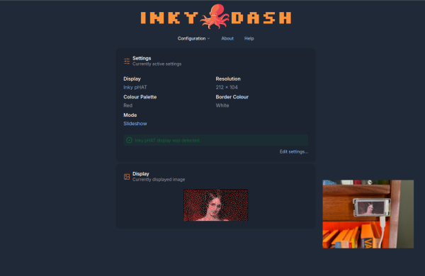
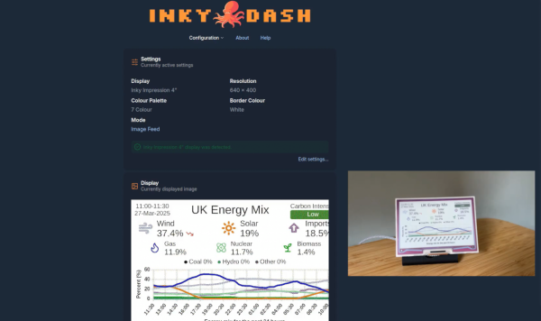

# `Inky Dash`

Inky dash is a web interface for Pimoroni's line of Raspberry Pi ePaper displays. It is intended to be self-hosted from
a Raspberry Pi and accessed from a browser.

The following displays are supported:

- [Inky pHAT (212 x 104)](https://shop.pimoroni.com/products/inky-phat?variant=12549254217811)
- [Inky pHAT (250 x 122)](https://shop.pimoroni.com/products/inky-phat?variant=12549254217811)
- [Inky Impression 4"](https://shop.pimoroni.com/products/inky-impression-4?variant=39599238807635)
- [Inky Impression 5.7"](https://shop.pimoroni.com/products/inky-impression-5-7?variant=32298701324371)
- [Inky Impression 7.3"](https://shop.pimoroni.com/products/inky-impression-7-3?variant=40512683376723)

## Features ✨

Inky Dash provides two different display modes.

### Slideshow

Slideshow mode automatically cycles through a collection of images at a chosen interval. You can select
which images to display and set the transition timing.

https://github.com/user-attachments/assets/68a7088d-d6e4-4474-94b9-65278ce625c9

*Video of Slideshow mode in action*



*Inky pHAT 212x104 display in Slideshow mode*

### Image Feed

Image Feed mode allows your display to automatically update with images from a specified web location. When
enabled, the display periodically checks a URL that points to a PNG or JPEG image, downloading and
displaying the latest version at your chosen interval.

The display will only update when the downloaded image differs from the currently displayed image.

https://github.com/user-attachments/assets/7950718a-322a-4d3b-8344-30b2bd62b36c

*Video of Image Feed mode in action*

#### Image Feed Projects

While image feed mode can be used with any hosted image, such as webcam feeds, the following projects are specifically
designed to generate images that can be easily integrated with this mode.

- [Inky Dash Energy Mix Image Feed](https://github.com/r-rayns/inky_uk_energy)
- [Inky Dash YouTube Live Image Feed](https://github.com/r-rayns/inky_yt_capture)



*Inky Impression 4" displaying the energy mix image feed*

#### Make your own

Image feed mode opens up the possibility of creating your own image feeds. Just host an image, either locally (for
personal use) or on the web and then point Inky Dash to that location. If you do make your own image feed project,
let me know and I can list it here for others to discover.

## Running 🏃

### 1. Download the binary

The best way to run Inky Dash on your Raspberry Pi is to download the relevant binary from the latest GitHub release.

- If you have a Raspberry Pi Zero or a Raspberry Pi 1 you'll want the ARMv6 binary.
- If you have a Raspberry Pi Zero 2 or a Raspberry Pi 2, 3, 4 or 5 you'll want the ARMv8 binary.

### 2. Enable I2C and SPI

**You must ensure that you've [enabled I2C and SPI](#Enabling-I2C-and-SPI) on your Raspberry Pi for the display to
work.**

### 3. Create a systemd service

Follow the steps for running the binary as a service, outlined under [set up a systemd service](#Running-as-a-service-).

### Alternatively

Alternatively you can perform the manual setup by following the steps outlined under [manual setup](#Manual-setup-).

### Enabling I2C and SPI

1. Run raspi-config on your Raspberry Pi.

   ```bash
   sudo raspi-config
   ```

2. In the menu, go to Interface Options.
3. Select I2C and enable it.
4. Repeat for SPI and enable it.
5. Select Finish and reboot the Pi.

## Manual setup 🛠️

These steps will guide you through downloading the project and transferring it to your Raspberry Pi.

**Ensure you have [enabled I2C and SPI](#Enabling-I2C-and-SPI) on your RaspberryPi**

### 1. Download the project

Download this repository from GitHub. You can clone it using:

```bash
git clone https://github.com/r-rayns/inky_dash.git`
```

### 2. Build the front-end

Change directories to the `./inky_dash/frontend` directory and build the front-end

```bash
cd frontend
npm install; npm run build
```

The build will be output to the `./frontend/dist` directory.

Move the contents of the build from the `dist` directory to the `./backend/public` directory

### 3. Transfer the project to the Raspberry Pi

Compress the `inky_dash` directory and transfer it across to your Raspberry Pi.

```bash
tar -czf inky_dash.tar.gz inky_dash
scp inky_dash.tar.gz <pi_username>@<pi_address>:~/
```

### 4. Extract the project on the Raspberry Pi

Once the transfer is complete, SSH onto your Raspberry Pi and extract `inky_dash.tar.gz` into the Raspberry Pi's home
directory.

```bash
tar -xzf inky_dash.tar.gz inky_dash
```

### 5. Install the project dependencies

Next install the project dependencies.

The best way to install dependencies is to create a new Python virtual environment:

```bash
# Create the virtual environment directory, if it doesn't already exist
mkdir ~/venv
# Create the virtual environment
python3 -m venv ~/venv/inky-dash
# Activate the virtual environment
source ~/venv/inky-dash/bin/activate
```

then run the following, from the project root:

```bash
cd ~/inky_dash
pip install -r requirements.txt
```

**If you experience errors here check the [Trouble Shooting](#Trouble-Shooting-) section.**

### 6. Open firewall port 8080

**If required**, allow port 8080 through your firewall, see [ufw](https://help.ubuntu.com/community/UFW).

```bash
sudo ufw allow 8080/tcp comment INKY-DASH
```

### 7. Run Inky Dash

If you just want to quickly run Inky Dash then go to the project root and execute:

```bash
python3 run.py
```

**The recommended way to run this project is as a service. This ensures it starts automatically on boot and stays
running
in the background as a managed process.**

### 8. Setting up a systemd service

A systemd file can be used to run inky dash as a service. Follow the steps outline [here](#Running-as-a-service-),
you'll
want to follow the instructions for running the Python script as a service.

## Building a binary 📦

> You can alternatively use the pre-compiled binary attached to the release (if one is available for your CPU
> architecture)

PyInstaller can be used to create a single binary file that can be used to run Inky Dash.
**Ensure that the build process is executed on the CPU architecture that matches the target environment.**

From the project root run:

```bash
pyinstaller run.spec
```

This will create a binary called `run` inside the `dist` directory of the project root.
You can rename this binary to something more meaningful such as `inky_dash.bin`

To start Inky Dash run the binary e.g. `./dist/run`.

**It is recommended that you run the Inky Dash binary as a service.**

## Running as a service ⚙️

### 1. Crate a `.service` file

Change directories to:

```bash
cd /etc/systemd/system/
```

and create a new `.service` file:

```bash
touch inky_dash.service
```

### 2. Edit the file

Choose from one of the following options, depending on if you want to run the binary as a service or the Python script
as a service

#### a) If you want to run the binary as a service

Copy the example below into the new file

- `WorkingDirectory` points to the directory containing your binary file.
- `ExecStart` path to the binary file. Replace `binary_location` and `binary_name` with the correct path and name.
- `your_username` should be replaced with the correct username.

```bash
[Unit]
Description=Inky Dash Service
After=network.target

[Service]
User=<your_username>
WorkingDirectory=/home/<your_username>/<binary_location>
ExecStart=/home/<your_username>/<binary_location>/<binary_name>
Restart=always

[Install]
WantedBy=multi-user.target
```

Save the file.

#### b) If you want to run the Python script as a service

Copy the example below into the new file.

- `WorkingDirectory` points to the project directory.
- `ExecStart` path should use the Python binary in the virtual environment you set up, to run `run.py`.
- `your_username` should be replaced with the correct username.

```bash
[Unit]
Description=Inky Dash Service
After=network.target

[Service]
User=<your_username>
WorkingDirectory=/home/<your_username>/inky_dash/
ExecStart=/home/<your_username>/venv/inky-dash/bin/python3 run.py
Restart=always

[Install]
WantedBy=multi-user.target
```

Save the file.

#### 3. Start the service

You'll now need to refresh the systemd daemon and enable the service:

```bash
# Refresh systemd so your new service is detected
sudo systemctl daemon-reload
# Enable your new service so it starts on boot
sudo systemctl enable inky_dash
# Start your new service
sudo service inky_dash start
```

## Trouble Shooting 🎯

You may need to install additional dependencies if you are running into issues:

- If there are issues with spidev: `sudo apt install python3-dev`
- If there are issues with numpy: `sudo apt install libopenblas0`

To see additional logs run with the `--dev` flag:

```bash
poetry run python3 run.py --dev
```

## Flags

- `--dev` Enables development mode for additional logging and hot-reloading.
- `--desktop` When running in a desktop environment, actions to update the Inky display will not be attempted.

## Development 🧑‍💻

### Updating dependencies

Dependencies are managed using [Poetry](https://python-poetry.org/). The requirements.txt file has been generated using
Poetry export:

```bash
poetry export --without-hashes -f requirements.txt -o requirements.txt
```

### Testing

Pytest is the test runner for this project. Run the tests with:

```bash
cd inky_dash
pytest
```

Or if you are using Poetry:

```bash
poetry run pytest
```

## Attribution 🏷️

- The stand I use for my Pi Zero 2 W was 3D printed using an Adafruit [design](https://github.com/adafruit/Adafruit_Learning_System_Guides/tree/main/Pi_Zero_Stand).

