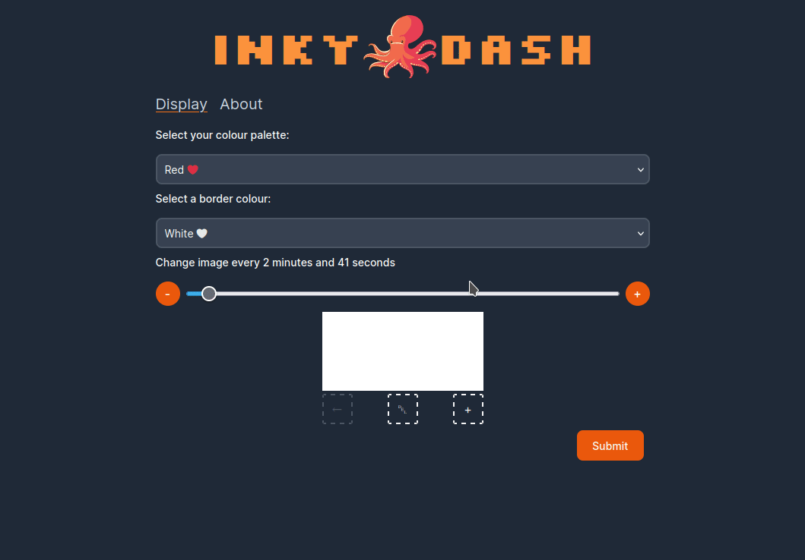

# Inky Dash
Inky dash is an interface for [Inky pHAT](https://shop.pimoroni.com/products/inky-phat?variant=12549254217811), an e-paper display for the Raspberry Pi, that can be accessed from a browser via a local web server.


## Running 🏃
### Setup Inky pHAT on the Raspberry Pi
1. Ensure the Inky pHAT is correctly setup on the Raspberry Pi. Typically this should just be a case of running:
`curl https://get.pimoroni.com/inky | bash` as per the [guide](https://learn.pimoroni.com/article/getting-started-with-inky-phat).
For additional help setting up the display follow [this tutorial](https://learn.pimoroni.com/tutorial/sandyj/getting-started-with-inky-phat).
2. Reboot the Raspberry Pi once setup is complete.
### Build the front-end
1. `cd` into the `frontend` directory
2. Run `npm install; npm run build`
3. This will output the build to `./frontend/out`
4. Move the contents of the build from the `out` directory to `./backend/public`
### Run Inky on the Raspberry Pi
1. Compress the `inky_dash` directory and transfer it across to the Raspberry Pi.
2. SSH into the Raspberry Pi.
3. Once the transfer is complete, extract `inky_dash` into the Raspberry Pi's home directory.
4. This project uses [Poetry](https://python-poetry.org/), so you do not need to create a new Python virtual environment manually
5. Change directories to the project root.
6. Install the required Python libraries using Poetry: `poetry install`.
7. If required, setup ufw and allow port 8080.
8. From the project root run: `poetry run python3 run.py &`.
9. Hopefully the Inky Dash UI should now be accessible on port 8080 of the Raspberry Pi.

## Building a binary 📦
PyInstaller can be used to create a single binary file which can run Inky Dash.
Ensure that the build process is executed on the CPU architecture that matches the target environment.
1. From the project root run `poetry run pyinstaller run.spec`
2. This should create a binary called `run` inside the `dist` directory
3. To start Inky Dash run the binary e.g. `./dist/run.py`

**You can alternatively use the pre-compiled binary attached to the release (if one is available for your CPU architecture)**

### Alternative build process using Requirements.txt
If you are unable to use Poetry or it is not working, you can manually setup a virtual environment, install all the dependencies and run pyinstaller.

- Create a directory to contain your Python virtual environments (if you don't already have one).

```
mkdir ~/venv
cd ~/venv
```

- Generate a new virtual environment.

```
python3 -m venv ~/venv/inky-dash
```

- Activate the virtual environment.

```
source ~/venv/inky-dash/bin/activate
```

- Install the requirements.

```
cd ~/inky_dash
pip install -r requirements.txt
```

*The requirements.txt file has been generated using Poetry export:*

```bash
poetry export --without-hashes -f requirements.txt -o requirements.txt
```

## Running as a service 📎

A systemd file can be used to run inky dash as a service.

1. Create a new file called `inky_dash.service` in `/etc/systemd/system/`.

2. Copy the example below into the new file. Check the `ExecStart` path points to the Inky Dash binary and the `WorkingDirectory` points to the parent directory of the binary. Replace `your_username` with the correct username.

```
[Unit]
Description=Inky Dash Service
After=network.target

[Service]
ExecStart=/home/your_username/inky_dash/dist/run
WorkingDirectory=/home/your_username/inky_dash/dist
User=your_username
Restart=always

[Install]
WantedBy=multi-user.target
```

3. Save the systemd service file.

4. Refresh systemd then enable and start the service

```
sudo systemctl daemon-reload
sudo systemctl enable inky_dash.service
sudo systemctl start inky_dash.service
```


## Trouble Shooting 🎯
To see additional logs run with the `--dev` flag:

```bash
poetry run python3 run.py --dev
```

- If there are issues with spidev: `sudo apt install python3-dev`
- If there are issues with numpy: `sudo apt install libopenblas0`


## Image Constraints 🖼️
Uploaded images must conform with the confines of the Inky pHAT display:
- Dimensions are 212 x 104 pixels (I have not yet got around to supporting the newer 250x122 dimensions).
- Colour palette is white, black and (red or yellow) in that order, see [here](https://github.com/pimoroni/inky/blob/master/tools/inky-palette.gpl).
- File format is PNG.
- File is 100KB or less in size.

## Testing 🧪
Pytest is the test runner for this project. Run the tests with:

```bash
cd inky_dash
pytest
```

Or if you are using Poetry:

```bash
poetry run pytest
```
